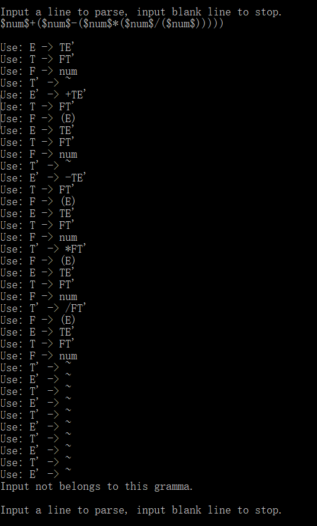

# 语法分析器

- [语法分析器](#%E8%AF%AD%E6%B3%95%E5%88%86%E6%9E%90%E5%99%A8)
	- [环境](#%E7%8E%AF%E5%A2%83)
	- [题目](#%E9%A2%98%E7%9B%AE)
	- [算法（摘自课本）](#%E7%AE%97%E6%B3%95%E6%91%98%E8%87%AA%E8%AF%BE%E6%9C%AC)
		- [算法4.1 - 非递归预测分析方法](#%E7%AE%97%E6%B3%9541---%E9%9D%9E%E9%80%92%E5%BD%92%E9%A2%84%E6%B5%8B%E5%88%86%E6%9E%90%E6%96%B9%E6%B3%95)
		- [算法4.2 - 预测分析表的构造方法](#%E7%AE%97%E6%B3%9542---%E9%A2%84%E6%B5%8B%E5%88%86%E6%9E%90%E8%A1%A8%E7%9A%84%E6%9E%84%E9%80%A0%E6%96%B9%E6%B3%95)
	- [设计与实现](#%E8%AE%BE%E8%AE%A1%E4%B8%8E%E5%AE%9E%E7%8E%B0)
		- [文法输入](#%E6%96%87%E6%B3%95%E8%BE%93%E5%85%A5)
		- [文法存储](#%E6%96%87%E6%B3%95%E5%AD%98%E5%82%A8)
			- [符号的存储](#%E7%AC%A6%E5%8F%B7%E7%9A%84%E5%AD%98%E5%82%A8)
			- [符号表](#%E7%AC%A6%E5%8F%B7%E8%A1%A8)
			- [文法表](#%E6%96%87%E6%B3%95%E8%A1%A8)
		- [解析串输入](#%E8%A7%A3%E6%9E%90%E4%B8%B2%E8%BE%93%E5%85%A5)
		- [工作流程设计与实现](#%E5%B7%A5%E4%BD%9C%E6%B5%81%E7%A8%8B%E8%AE%BE%E8%AE%A1%E4%B8%8E%E5%AE%9E%E7%8E%B0)
	- [测试与说明](#%E6%B5%8B%E8%AF%95%E4%B8%8E%E8%AF%B4%E6%98%8E)
		- [输入](#%E8%BE%93%E5%85%A5)
		- [输出](#%E8%BE%93%E5%87%BA)
	- [运行截图](#%E8%BF%90%E8%A1%8C%E6%88%AA%E5%9B%BE)

## 环境

- 运行环境 - Windows 10
- 开发环境 - Visual Studio 2017

## 题目

**实验内容** - 编写语法分析程序，实现对算术表达式的语法分析。要求所分析算术表达式由如下文法产生：

```
E -> E+T | E-T | T
T -> T*F | T/F | F
F -> (E) | num
```

**实验要求**
- 在对输入的算术表达式进行分析的过程中，依次输出所采用的产生式。
- 编程实现课本P92页的算法4.2，为给定文法自动构造预测分析表
- 编程实现课本P88页的算法4.1，构造LL(1)预测分析程序

## 算法（摘自课本）

### 算法4.1 - 非递归预测分析方法

- 输入 - 输入符号串ω、文法G的一张预测分析表M
- 输出 - 若ω∈L(G)则输出ω的最左推导，否则报错

方法：

```c++
初始化{
	将$压入栈底
	将文法开始符号S压入栈顶
	将ω$放入输入缓冲区中
	向前指针ip指向ω$的第一个符号
}
根据预测分析表M对输入符号串ω做出自顶向下分析{
	do {
		令X是栈顶文法符号，a是ip指向的符号
		if (X是终结符号 || X == '$'){
			if (X == a){
				从栈顶弹出X
				ip向前移动一个位置
			} else {
				ERROR
			}
		} else { // X是非终结符
			if (M[X, a] == X -> Y1Y2...Yk){
				从栈顶弹出X
				依次把Yk, Y(k-1), ..., Y1压入栈 // Y1在栈顶
				输出产生式X -> Y1Y2...Yk
			} else {
				ERROR
			}
		}
	} while (X != '$'); // 栈非空，分析继续
}
```

### 算法4.2 - 预测分析表的构造方法

- 输入 - 文法G
- 输出 - 文法G的预测分析表M

方法：

```c++
for (文法G的每一个产生式A -> α){
	for (每个终结符号a∈FIRST(α))
		把A -> α放入表项M[A, a]中
	if (ε∈FIRST(α))
		for (每个b∈FOLLOW(A))
			把A -> α放入表项M[A, b]中
}
for (所有没有定义的表项M[A, a]) 标上错误标识
```

## 设计与实现

### 文法输入

文法输入要求：
- 无环路
- 无ε-生成式

文法输入格式：
- 解析时会**忽略所有空格和制表符**，所以如果为了美观可以添加任意数量的空格和制表符
- **每行只能有一个非终结符的生成式**，但是生成式可以有**多个候选式**。候选式使用`|`分隔
- 允许一个非终结符有多行生成式
- 单个非终结符以大写字母开头，后面可以接任意个英文单引号`'`
- 生成式的左侧只能有一个非终结符，此非终结符后面必须有箭头`->`。
- 只识别每行的第一个箭头`->`，同一行后面还有箭头会视为终结符
- 字符`~`表示ε，即空串
- **因为字符`$`作为分析结束符号，不能出现在文法中，所以使用两个`$`引起来的字符串被视为一个终结符，如`$num$`将把`num`视为一个非终结符而不是三个。要求`$`中的字符串长度大于1。如果没有使用配对的`$`而仅使用了单个`$`则视为错误**
- 上面没有提到的可打印符号均可作为终结符。终结符后面可以接任意个英文单引号`'`
- **默认第一行生成式左侧的非终结符为起始符号**

输入示例：

```
E -> E+T | E-T | T
T -> T*F | T/F | F
F -> (E) | $num$
```

### 文法存储

#### 符号的存储

```c++
struct Symbol
{
	enum SymbolType
	{
		T, // terminator
		NT // non-terminator
	};
	SymbolType type;
	int index; // index in SymbolTable
};
```

定义了枚举常量T（终结符）和NT（非终结符）作为符号类型。定义结构Symbol，包含一个符号类型type和一个在符号表中的索引index

定义以下两个特殊的终结符：

```c++
const Symbol EPSILON = {Symbol::SymbolType::T, 0}; // ε
const Symbol END = {Symbol::SymbolType::T, 1}; // $
```

严格来说空串`ε`和输入结束符`$`不算是终结符。此处视为终结符方便管理

#### 符号表

```c++
template <bool isTerminatorTable>
class SymbolTable
{
private:
	Symbol::SymbolType type;
	vector<string> symbols;

public:
	SymbolTable();
	int getIndex(const string &str);						 // if str not exist, push it into symbols
	int getIndex(const string &str, bool) const; // return -1 if str not exist
	string getStr(int i) const;									 // return blank string if i is invalid
	int size() const { return symbols.size(); }
};
using T_Table = SymbolTable<true>;
using NT_Table = SymbolTable<false>;
```

符号表分为两种：终结符表和非终结符表。其中终结符表在构造时就需要添加符号`$`和`ε`。为了方便理解，使用`using`对不同类型的符号表进行了重命名，即T_Table和NT_Table。为了实现以上两点，使用**模板**来设计符号表，模板参数isTerminatorTable表示了此符号表是否是终结符号表

符号表中并没有保存符号Symbol，而是保存了每个符号的字符串量，即`vector<string> symbols`，所以不能从符号表获得符号，但是可以根据符号的下标来查询字符串量（即getStr方法），也可以根据符号的字符串量来查询下标（即getIndex）。所以符号表只是一个用来查询的表，并不是一个符号的容器

函数解释：
- `int getIndex(const string &str)` - 查询字符串并返回下标。如果没有此字符串则插入此字符串
- `int getIndex(const string &str, bool) const` - 仅查询字符串并获得下标
- `string getStr(int i) const` - 查询对应下标的符号的字符串
- `int size() const` - 查询符号表容量

#### 文法表

```c++
class GrammaTable
{
private:
	// input
	vector<Gramma> grammas;
	T_Table tTable;
	NT_Table ntTable;

	// error handling
	int lineCount;
	bool error;

	// process
	vector<First> firsts;
	vector<Follow> follows;
	map<MapKey, TableItem> M; // predict analysis table

	void killBlank(string &str) const; // discard blank chars
	bool format(string &str) const;		 // return false if format is wrong
	/**
	 * killDuplicated:
	 * eliminate same Candidate in grammas[index] if index != -1
	 * eliminate same Candidate in each Gramma when index == -1
	 */
	void killDuplicated(int index = -1);
	void killExplicitLeftRecursion(int index);
	void killEpsilon();
	void killLeftRecursion();
	void getFirsts();
	First getFirst(const Candidate &candidate) const;
	void getFollows();
	bool getM();
	Candidate parseInputToCandidate(const string &str) const; // return empty candidate if error
	void outputSingleCandidate(int ntIndex, int candidateIndex) const;

public:
	GrammaTable() : lineCount(0), error(false){};

	int insert(const string &grammaLine); // return 0 if ok, otherwise return lineCount
	bool generate();											// return false if error
	void output() const;

	bool ok() const { return !error; }
	int currentLineCount() const { return lineCount; }
	bool parse(const string &str) const;
};
```

文法表包括了文法grammas、符号表tTable和ntTable、此文法生成的FIRST集与FOLLOW集和预测分析表M

```c++
using Candidate = vector<Symbol>;
using Gramma = vector<Candidate>;
```

一个候选式Candidate由若干个符号Symbol组成，一个符号的生成式Gramma由若干个候选式Candidate组成

```c++
using First = set<Symbol>;
using Follow = set<Symbol>;
```

FIRST集和FOLLOW集是符号Symbol的集合。为了使用`std::set`，需要给Symbol设置`operator<`使其能够比较大小。比大小采取的方案是：使用Symbol的index作为值，Symbol的type作为值的正负号，这样每一个Symbol都会有一个唯一的值

```c++
struct TableItem // item in predict analysis table M
{
	int ntIndex = -1;				 // non-terminator index in grammas
	int candidateIndex = -1; // candidate index in grammas[ntIndex]
};

struct MapKey
{
	int ntIndex;
	int tIndex;
};
```

预测分析表`map<MapKey, TableItem> M`为一个key-value单向映射的表。表的键MapKey由一个非终结符（的下标）和一个终结符（的下标）构成，表项TableItem由一个非终结符（的下标）和此非终结符生成式的一个候选式（的下标）构成。

为了使用`std::map`，需要给MapKey设置`operator<`使其能够比较大小。采取的方案是：每个MapKey的值等于`ntIndex + 100 * tIndex`，这样可以保证小规模输入时每个MapKey都会有一个唯一的值。

变量lineCount和error用来控制错误，当错误发生时不能够继续输入文法、不能生成FIRST集和FOLLOW集、不能解析输入串。输入错误时会返回lineCount，根据此值可以定位输入的错误

函数解释：
- private
	- `void killBlank(string &str) const;` - 清除输入串中的空白符（空格、制表、换行）
	- `bool format(string &str) const;` - 如果输入串没有`->`则报错
	- `void killDuplicated(int index = -1);` - 清除第index个非终结符的重复生成式。index为-1时清除所有非终结符的重复生成式
	- `void killExplicitLeftRecursion(int index);` - 消除第index个非终结符生成式中的直接左递归
	- `void killEpsilon();` - 清除所有候选式中多余的ε
	- `void killLeftRecursion();` - 消除直接和间接左递归
	- `void getFirsts();` - 生成所有非终结符的FIRST集
	- `First getFirst(const Candidate &candidate) const;` - 在所有非终结符的FIRST存在的情况下生成单个候选式的FIRST集
	- `void getFollows();` - 生成所有非终结符的FOLLOW集
	- `bool getM();` - 生成预测分析表
	- `Candidate parseInputToCandidate(const string &str) const;` - 把字符串解析为符号串
	- `void outputSingleCandidate(int ntIndex, int candidateIndex) const;` - 输出单个生成式
- public
	- `int insert(const string &grammaLine);` - 插入一行文法。如果文法出错则返回lineCount，否则返回0
	- `bool generate();` - 生成FIRST集、FOLLOW集和预测分析表，如果生成失败则返回false
	- `void output() const;` - 输出消左递归后的文法、FIRST集、FOLLOW集、预测分析表
	- `bool ok() const { return !error; }` - 判断此预测分析表是否能够正常继续输入
	- `int currentLineCount() const { return lineCount; }` - 返回当前行数，通常用来确定错误发生的位置
	- `bool parse(const string &str) const;` - 试图解析输入的字符串。如果解析失败则返回false

### 解析串输入

解析串输入的格式和文法的输入类似：
- 每个解析串只能有一行
- 解析串只能包含终结符
- 如果一个终结符包含多个非英文单引号`'`的字符，则可以像文法串一样使用两个`$`引起来
- 解析串中的所有空白字符（空格、换行、制表）会被消除

示例输入：

```
$num$+$num$*$num$/$num$-$num$
```

### 工作流程设计与实现

1. 输入文法
2. 消左递归
3. 计算FIRST集
4. 计算FOLLOW集
5. 输入文法符号串
6. 使用预测分析表分析

在main函数中的实现：

```c++
文法表gt
读取一行
while (不是空行且文法表未出错)
{
	gt.insert(此行文法);
}
gt.generate();生成消左递归文法、FIRST集、FOLLOW集和预测分析表
gt.output();输出消左递归文法、FIRST集、FOLLOW集和预测分析表
读取一行
while (不是空行)
{
	gt.parse(输入的解析串)
}
```

其中输入文法时输入空行结束，然后。输入解析串时一次一行，输入空行结束

## 测试与说明

### 输入

输入示例

```
E -> E+T | E-T | T
T -> T*F | T/F | F
F -> (E) | $num$
// 此处为空行，结束文法串的输入
$num$+$num$*$num$/$num$-$num$
($num$+($num$-($num$*($num$/($num$)))))
$num$
($num$+($num$-($num$*($num$/($num$))))
$num$+($num$-($num$*($num$/($num$)))))
($num$+($num$-($nu*($num$/($num$))))
// 此处为空行，结束解析串的输入
```

### 输出

```
*************************************************************
           Compiler-Grammatical-Analyzer(CGA)
                 Written By DiscreteTom
             See source code and report BUG at
https://github.com/DiscreteTom/Compiler-Grammatical-Analyzer
*************************************************************

Please input grammas.
Input blank line to stop input.
E -> E+T | E-T | T
T -> T*F | T/F | F
F -> (E) | $num$

Output:
Format gramma:
E -> TE'
T -> FT'
F -> (E) | num
E' -> +TE' | -TE' | ~
T' -> *FT' | /FT' | ~

First:
First(E): ( num
First(T): ( num
First(F): ( num
First(E'): ~ + -
First(T'): ~ * /

Follows:
Follow(E): $ )
Follow(T): $ + - )
Follow(F): $ + - * / )
Follow(E'): $ )
Follow(T'): $ + - )

Predict Analyze Table:
[E', ~]: E' -> ~
[T', ~]: T' -> ~
[E', $]: E' -> ~
[T', $]: T' -> ~
[E', +]: E' -> +TE'
[T', +]: T' -> ~
[E', -]: E' -> -TE'
[T', -]: T' -> ~
[T', *]: T' -> *FT'
[T', /]: T' -> /FT'
[E, (]: E -> TE'
[T, (]: T -> FT'
[F, (]: F -> (E)
[E', )]: E' -> ~
[T', )]: T' -> ~
[E, num]: E -> TE'
[T, num]: T -> FT'
[F, num]: F -> num


Input a line to parse, input blank line to stop.
$num$+$num$*$num$/$num$-$num$

Use: E -> TE'
Use: T -> FT'
Use: F -> num
Use: T' -> ~
Use: E' -> +TE'
Use: T -> FT'
Use: F -> num
Use: T' -> *FT'
Use: F -> num
Use: T' -> /FT'
Use: F -> num
Use: T' -> ~
Use: E' -> -TE'
Use: T -> FT'
Use: F -> num
Use: T' -> ~
Use: E' -> ~
Accept.


Input a line to parse, input blank line to stop.
($num$+($num$-($num$*($num$/($num$)))))

Use: E -> TE'
Use: T -> FT'
Use: F -> (E)
Use: E -> TE'
Use: T -> FT'
Use: F -> num
Use: T' -> ~
Use: E' -> +TE'
Use: T -> FT'
Use: F -> (E)
Use: E -> TE'
Use: T -> FT'
Use: F -> num
Use: T' -> ~
Use: E' -> -TE'
Use: T -> FT'
Use: F -> (E)
Use: E -> TE'
Use: T -> FT'
Use: F -> num
Use: T' -> *FT'
Use: F -> (E)
Use: E -> TE'
Use: T -> FT'
Use: F -> num
Use: T' -> /FT'
Use: F -> (E)
Use: E -> TE'
Use: T -> FT'
Use: F -> num
Use: T' -> ~
Use: E' -> ~
Use: T' -> ~
Use: E' -> ~
Use: T' -> ~
Use: E' -> ~
Use: T' -> ~
Use: E' -> ~
Use: T' -> ~
Use: E' -> ~
Use: T' -> ~
Use: E' -> ~
Accept.


Input a line to parse, input blank line to stop.
$num$

Use: E -> TE'
Use: T -> FT'
Use: F -> num
Use: T' -> ~
Use: E' -> ~
Accept.


Input a line to parse, input blank line to stop.
($num$+($num$-($num$*($num$/($num$))))

Use: E -> TE'
Use: T -> FT'
Use: F -> (E)
Use: E -> TE'
Use: T -> FT'
Use: F -> num
Use: T' -> ~
Use: E' -> +TE'
Use: T -> FT'
Use: F -> (E)
Use: E -> TE'
Use: T -> FT'
Use: F -> num
Use: T' -> ~
Use: E' -> -TE'
Use: T -> FT'
Use: F -> (E)
Use: E -> TE'
Use: T -> FT'
Use: F -> num
Use: T' -> *FT'
Use: F -> (E)
Use: E -> TE'
Use: T -> FT'
Use: F -> num
Use: T' -> /FT'
Use: F -> (E)
Use: E -> TE'
Use: T -> FT'
Use: F -> num
Use: T' -> ~
Use: E' -> ~
Use: T' -> ~
Use: E' -> ~
Use: T' -> ~
Use: E' -> ~
Use: T' -> ~
Use: E' -> ~
Use: T' -> ~
Use: E' -> ~
Input not belongs to this gramma.

Input a line to parse, input blank line to stop.
$num$+($num$-($num$*($num$/($num$)))))

Use: E -> TE'
Use: T -> FT'
Use: F -> num
Use: T' -> ~
Use: E' -> +TE'
Use: T -> FT'
Use: F -> (E)
Use: E -> TE'
Use: T -> FT'
Use: F -> num
Use: T' -> ~
Use: E' -> -TE'
Use: T -> FT'
Use: F -> (E)
Use: E -> TE'
Use: T -> FT'
Use: F -> num
Use: T' -> *FT'
Use: F -> (E)
Use: E -> TE'
Use: T -> FT'
Use: F -> num
Use: T' -> /FT'
Use: F -> (E)
Use: E -> TE'
Use: T -> FT'
Use: F -> num
Use: T' -> ~
Use: E' -> ~
Use: T' -> ~
Use: E' -> ~
Use: T' -> ~
Use: E' -> ~
Use: T' -> ~
Use: E' -> ~
Use: T' -> ~
Use: E' -> ~
Input not belongs to this gramma.

Input a line to parse, input blank line to stop.
($num$+($num$-($nu*($num$/($num$))))
Invalid input.

Input a line to parse, input blank line to stop.

请按任意键继续. . .
```

输出解释：
- 开发者信息
- 输入的三行文法串
- 消左递归后的文法
- 所有非终结符的FIRST集
- 所有非终结符的FOLLOW集
- 预测分析表（以键值对的方式输出表项）
- 输入的解析串
- 解析此串使用的生成式
- 解析成功(Accept)
- 输入的解析串
- 解析此串使用的生成式
- 解析成功(Accept)
- 输入的解析串
- 解析此串使用的生成式
- 解析成功(Accept)
- 输入的解析串
- 解析此串使用的生成式
- 解析失败(Input not belongs to this gramma)
	- 因为输入少了一个右括号
- 输入的解析串
- 解析此串使用的生成式
- 解析失败(Input not belongs to this gramma)
	- 因为输入少了一个左括号
- 输入的解析串
- 解析此串使用的生成式
- 解析失败(Invalid input)
	- 因为输入时输入了不在符号表中的终结符

## 运行截图

初始状态：


输入文法后：


输入正确串并成功解析：


输入错误串并解析报错：



输入空行结束程序：

